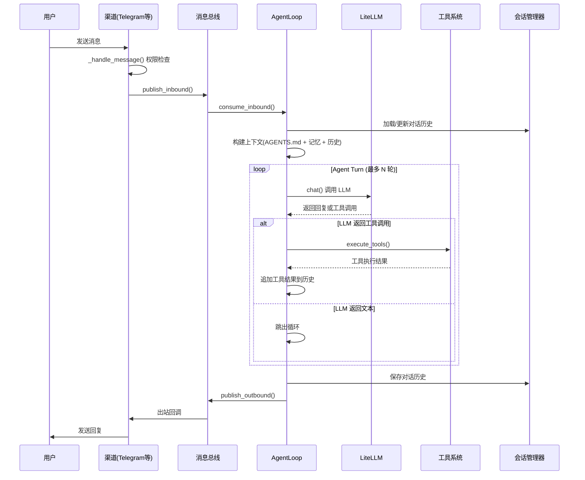

# Nanobot 源码学习指南

> 本文档是 nanobot 项目的完整源码通读指南，面向 Java 后端开发者，帮助你理解 Python 异步编程模式、nanobot 的架构设计，并与 OpenClaw 项目进行对比学习。
>
> **二开方向**：语音交互的多智能体系统 —— 一个核心对话管家 + 多个领域办事 Agent。

---

## 目录

1. [项目概览](#1-项目概览)
2. [技术栈速览（Java 开发者视角）](#2-技术栈速览java-开发者视角)
3. [项目结构总览](#3-项目结构总览)
4. [核心架构：消息驱动的 Agent 系统](#4-核心架构消息驱动的-agent-系统)
5. [模块逐一详解](#5-模块逐一详解)
   - 5.1 [入口模块](#51-入口模块)
   - 5.2 [配置系统 config/](#52-配置系统-config)
   - 5.3 [LLM 提供者 providers/](#53-llm-提供者-providers)
   - 5.4 [Agent 核心 agent/](#54-agent-核心-agent)
   - 5.5 [工具系统 agent/tools/](#55-工具系统-agenttools)
   - 5.6 [消息总线 bus/](#56-消息总线-bus)
   - 5.7 [会话管理 session/](#57-会话管理-session)
   - 5.8 [渠道系统 channels/](#58-渠道系统-channels)
   - 5.9 [CLI 命令 cli/](#59-cli-命令-cli)
   - 5.10 [定时任务 cron/](#510-定时任务-cron)
   - 5.11 [心跳服务 heartbeat/](#511-心跳服务-heartbeat)
   - 5.12 [工具函数 utils/](#512-工具函数-utils)
6. [数据流全景图](#6-数据流全景图)
7. [与 OpenClaw 的对比分析](#7-与-openclaw-的对比分析)
8. [二开指引：语音多 Agent 系统](#8-二开指引语音多-agent-系统)

---

## 1. 项目概览

**Nanobot** 是香港大学 HKUDS 实验室开源的轻量版个人 AI 助手，定位为 **OpenClaw 的简化替代品**。

| 特性 | 说明 |
|------|------|
| 定位 | 轻量级个人 AI 助手，可连接多种聊天平台 |
| 语言 | Python 3.11+，纯异步架构（asyncio） |
| 代码量 | ~8000 行（vs OpenClaw 数万行 TypeScript） |
| 核心理念 | 单文件可运行，最小依赖，易于理解和扩展 |
| 许可证 | MIT |

### 核心能力

- **多渠道接入**：Telegram、Discord、Slack、飞书、钉钉、QQ、WhatsApp、邮件、Mochat（共 9 个渠道）
- **LLM 集成**：通过 LiteLLM 支持 OpenAI / Anthropic / Google / 本地模型等 30+ 提供者
- **工具系统**：文件读写、Shell 执行、网页抓取、网页搜索、定时任务、子 Agent 派生
- **记忆系统**：基于 Markdown 文件的长期记忆 + 历史日志
- **会话管理**：每个用户/渠道独立的对话上下文
- **定时任务**：支持 cron 表达式、固定间隔、定时触发
- **心跳机制**：定期唤醒 Agent 检查待办任务

---

## 2. 技术栈速览（Java 开发者视角）

作为 Java 后端开发者，以下是理解本项目的关键对照：

| Python 概念 | Java 对应 | 说明 |
|-------------|-----------|------|
| `asyncio` | `CompletableFuture` / Project Loom | Python 的异步编程框架，类似 Java 的虚拟线程 |
| `await` | `.get()` / `.join()` | 等待异步操作完成 |
| `asyncio.Task` | `Future<T>` | 异步任务句柄 |
| `asyncio.Queue` | `BlockingQueue` | 异步消息队列 |
| `@dataclass` | `record` / Lombok `@Data` | 自动生成构造器、equals、toString 等 |
| `Pydantic` | Jackson + Bean Validation | 数据验证和序列化框架 |
| `Typer` | Spring Shell / picocli | CLI 框架 |
| `loguru` | SLF4J + Logback | 日志框架 |
| `httpx` | OkHttp / WebClient | 异步 HTTP 客户端 |
| `ABC` (Abstract Base Class) | `interface` / `abstract class` | 抽象基类，定义接口规范 |
| `typing.Protocol` | Java `interface` | 结构化类型（鸭子类型的形式化） |
| `Path` (pathlib) | `java.nio.file.Path` | 路径操作 |
| `pip` / `pyproject.toml` | Maven / Gradle | 依赖管理 |

### 关键编程模式

```
Java 思维                         Python (nanobot) 实现
─────────────────────────────    ──────────────────────────────
Spring Boot Application          __main__.py + Typer CLI
@Autowired 依赖注入               构造函数手动传参
Spring Events                    MessageBus (asyncio.Queue)
@Scheduled 定时任务               CronService (asyncio.Task)
Spring WebSocket                 各渠道的 SDK/WebSocket 实现
JPA/Repository                   JSON 文件直接读写
Spring Profiles                  config.json + 环境变量
```

---

## 3. 项目结构总览

```
nanobot/
├── __init__.py              # 包元信息（版本号、Logo）
├── __main__.py              # 入口：python -m nanobot
├── config/                  # 配置系统
│   ├── __init__.py
│   ├── loader.py            # 配置加载器（JSON 文件 + 环境变量）
│   └── schema.py            # 配置数据模型（Pydantic）
├── providers/               # LLM 提供者层
│   ├── __init__.py
│   ├── base.py              # 提供者抽象基类
│   ├── litellm_provider.py  # LiteLLM 统一提供者实现
│   ├── registry.py          # 提供者注册表（30+ 提供者元数据）
│   └── transcription.py     # 语音转文字服务
├── agent/                   # Agent 核心
│   ├── __init__.py
│   ├── loop.py              # Agent 主循环（核心！）
│   ├── context.py           # 上下文构建器
│   ├── memory.py            # 记忆系统
│   ├── skills.py            # 技能加载器
│   ├── subagent.py          # 子 Agent 派生
│   └── tools/               # 工具系统
│       ├── __init__.py
│       ├── base.py          # 工具基类
│       ├── registry.py      # 工具注册表
│       ├── filesystem.py    # 文件系统工具
│       ├── shell.py         # Shell 执行工具
│       ├── web.py           # 网页抓取 + 搜索
│       ├── cron.py          # 定时任务管理工具
│       └── spawn.py         # 子 Agent 派生工具
├── bus/                     # 消息总线
│   ├── __init__.py
│   ├── events.py            # 事件类型定义
│   └── queue.py             # 异步消息队列实现
├── session/                 # 会话管理
│   ├── __init__.py
│   └── manager.py           # 会话持久化管理器
├── channels/                # 渠道系统（消息平台接入）
│   ├── __init__.py
│   ├── base.py              # 渠道抽象基类
│   ├── manager.py           # 渠道管理器（统一启停）
│   ├── telegram.py          # Telegram Bot
│   ├── discord.py           # Discord Bot
│   ├── slack.py             # Slack Bot
│   ├── feishu.py            # 飞书/Lark Bot
│   ├── dingtalk.py          # 钉钉 Bot
│   ├── qq.py                # QQ Bot
│   ├── whatsapp.py          # WhatsApp（Node.js 桥接）
│   ├── email.py             # 邮件（IMAP + SMTP）
│   └── mochat.py            # Mochat（Socket.IO + HTTP 轮询）
├── cli/                     # CLI 命令行界面
│   ├── __init__.py
│   └── commands.py          # 所有命令定义（onboard/gateway/agent/cron/status）
├── cron/                    # 定时任务系统
│   ├── __init__.py
│   ├── service.py           # 调度服务
│   └── types.py             # 数据模型
├── heartbeat/               # 心跳服务
│   ├── __init__.py
│   └── service.py           # 周期性唤醒 Agent
└── utils/                   # 通用工具函数
    ├── __init__.py
    └── helpers.py            # 路径管理、字符串处理等
```

---

## 4. 核心架构：消息驱动的 Agent 系统

### 整体架构图

```
┌─────────────────────────────────────────────────────────┐
│                    CLI 命令层 (Typer)                     │
│  onboard │ gateway │ agent │ channels │ cron │ status    │
└────────────────────────┬────────────────────────────────┘
                         │
                         ▼
┌─────────────────────────────────────────────────────────┐
│                   Gateway 编排层                         │
│  (cli/commands.py 的 gateway 命令负责创建和连接所有组件)   │
└──┬──────────┬───────────┬────────────┬─────────────┬────┘
   │          │           │            │             │
   ▼          ▼           ▼            ▼             ▼
┌──────┐ ┌────────┐ ┌─────────┐ ┌──────────┐ ┌──────────┐
│渠道  │ │消息总线│ │  Agent  │ │  Cron    │ │Heartbeat │
│管理器│◄►│(Queue) │◄►│主循环   │ │  定时器  │ │  心跳    │
└──┬───┘ └────────┘ └────┬────┘ └──────────┘ └──────────┘
   │                     │
   ▼                     ▼
┌──────────────┐  ┌──────────────────────────┐
│ 9 个渠道实现  │  │  LLM + 工具 + 记忆 + 会话 │
│ Telegram     │  │  ┌──────┐ ┌────────┐     │
│ Discord      │  │  │LiteLLM│ │工具注册表│    │
│ Slack        │  │  └──────┘ └────────┘     │
│ 飞书 ...     │  │  ┌──────┐ ┌────────┐     │
│              │  │  │记忆系统│ │会话管理器│    │
└──────────────┘  │  └──────┘ └────────┘     │
                  └──────────────────────────┘
```

### 核心消息流

```
用户消息 → 渠道接收 → 消息总线 → Agent 处理 → 消息总线 → 渠道发送 → 用户
```

详细流程：

1. **用户发消息**：通过 Telegram/Discord/飞书等平台
2. **渠道接收**：对应的 Channel 类接收消息，调用 `_handle_message()`
3. **发布到总线**：`MessageBus.publish_inbound()` → 入站队列
4. **Agent 消费**：`AgentLoop.run()` 从入站队列取消息
5. **构建上下文**：加载系统提示词、记忆、历史对话
6. **调用 LLM**：通过 LiteLLM 调用大语言模型
7. **工具执行**：如果 LLM 返回工具调用，执行工具并循环
8. **生成回复**：最终文本回复
9. **发布出站**：`MessageBus.publish_outbound()` → 出站队列
10. **渠道发送**：对应的 Channel 从出站队列取消息并发送

---

## 5. 模块逐一详解

### 5.1 入口模块

**文件**：`__init__.py`、`__main__.py`

- `__init__.py`：定义版本号 `__version__` 和 ASCII Logo `__logo__`
- `__main__.py`：仅一行 `from nanobot.cli.commands import app; app()`，使 `python -m nanobot` 可运行

> **Java 对照**：类似 Spring Boot 的 `@SpringBootApplication` 主类，但更简洁。

### 5.2 配置系统 config/

**文件**：`loader.py`、`schema.py`

| 文件 | 职责 | Java 对照 |
|------|------|-----------|
| `schema.py` | 用 Pydantic 定义所有配置的数据模型 | `@ConfigurationProperties` Bean |
| `loader.py` | 从 JSON 文件加载配置 + 环境变量覆盖 | Spring 的 `application.yml` 加载器 |

**关键设计**：
- 配置文件路径：`~/.nanobot/config.json`（可通过 `NANOBOT_CONFIG` 环境变量覆盖）
- 支持嵌套配置：`providers` → `openrouter` → `api_key`
- 环境变量映射：`NANOBOT_OPENROUTER_API_KEY` → `config.providers.openrouter.api_key`
- alias 机制：JSON 中可使用 camelCase（`apiKey`），Python 中使用 snake_case（`api_key`）

**重要类**：
```python
class Config:               # 顶层配置
  ├── providers: Providers  # LLM 提供者配置
  ├── agents: AgentsConfig  # Agent 行为配置
  ├── channels: Channels    # 渠道配置
  ├── tools: ToolsConfig    # 工具配置
  └── workspace_path: Path  # 工作空间路径
```

### 5.3 LLM 提供者 providers/

**文件**：`base.py`、`litellm_provider.py`、`registry.py`、`transcription.py`

| 文件 | 职责 |
|------|------|
| `base.py` | 定义 `LLMProvider` 抽象基类（聊天、流式、工具调用接口） |
| `litellm_provider.py` | 使用 LiteLLM 库实现统一的 LLM 调用（**核心**） |
| `registry.py` | 30+ LLM 提供者的元数据注册表（名称、环境变量、API 基地址等） |
| `transcription.py` | 语音转文字服务（调用 Whisper 等 STT 模型） |

**关键设计**：
- **LiteLLM 统一层**：一个库调用 30+ LLM 提供者，模型名格式如 `openrouter/gpt-4o`、`anthropic/claude-3.5-sonnet`
- **工具调用**：支持 OpenAI 格式的函数调用（function calling）
- **流式输出**：`chat_stream()` 返回异步生成器，可逐 token 输出
- **语音转文字**：`transcription.py` 为你的语音交互二开提供了现成基础

> **二开重点**：`transcription.py` 已实现了语音转文字，你可以在此基础上添加文字转语音（TTS）功能。

### 5.4 Agent 核心 agent/

**文件**：`loop.py`（核心）、`context.py`、`memory.py`、`skills.py`、`subagent.py`

这是整个项目最重要的模块。

#### loop.py — Agent 主循环

这是 nanobot 的心脏。`AgentLoop` 类负责：
1. 监听消息总线的入站消息
2. 加载上下文（系统提示词 + 记忆 + 历史）
3. 调用 LLM 获取回复
4. 如果 LLM 返回工具调用，执行工具并将结果反馈给 LLM（循环）
5. 最终将文本回复发布到出站队列

**核心方法**：
```python
class AgentLoop:
    async def run()              # 主运行循环（监听入站消息）
    async def _process()         # 处理单条消息的完整流程
    async def _agent_turn()      # 单轮 Agent 对话（LLM 调用 + 工具执行循环）
    async def _execute_tools()   # 批量执行工具调用
    async def process_direct()   # 直接处理消息（不经过消息总线，CLI 用）
```

**工具循环**（类似 Java 的 while 循环）：
```
while 还有工具调用 and 未超过最大迭代次数:
    1. 调用 LLM
    2. 如果 LLM 返回 tool_calls:
       - 并行执行所有工具
       - 将工具结果追加到对话历史
       - 继续循环
    3. 如果 LLM 返回纯文本:
       - 跳出循环，返回回复
```

#### context.py — 上下文构建器

负责构建发送给 LLM 的系统提示词，按优先级组合：
1. **AGENTS.md**：Agent 指令/人设（类似 Spring 的 `application.properties`）
2. **SOUL.md**：Agent 灵魂/性格描述
3. **USER.md**：用户信息和偏好
4. **memory/MEMORY.md**：长期记忆
5. **技能描述**：已加载的技能列表
6. **当前时间**：让 Agent 感知时间
7. **工具说明**：可用工具的描述

#### memory.py — 记忆系统

基于 Markdown 文件的简单记忆机制：
- `memory/MEMORY.md`：长期记忆（用户偏好、重要信息）
- `memory/HISTORY.md`：历史事件日志
- Agent 通过文件系统工具读写这些文件实现"记忆"

#### subagent.py — 子 Agent 派生

支持主 Agent 派生子 Agent 执行子任务：
- 子 Agent 继承父 Agent 的配置但有独立的对话历史
- 通过 `spawn` 工具触发
- 适合你的多 Agent 架构二开

> **二开重点**：`subagent.py` 是实现"核心管家 + 领域 Agent"的关键模块。

### 5.5 工具系统 agent/tools/

**文件**：`base.py`、`registry.py`、`filesystem.py`、`shell.py`、`web.py`、`cron.py`、`spawn.py`

| 工具 | 文件 | 功能 |
|------|------|------|
| read_file / write_file / list_dir | filesystem.py | 文件系统操作 |
| exec | shell.py | 执行 Shell 命令 |
| fetch_page / brave_search | web.py | 网页抓取和搜索 |
| cron_add / cron_list / cron_remove | cron.py | 定时任务管理 |
| spawn | spawn.py | 派生子 Agent |

**扩展机制**：
1. 继承 `BaseTool` 基类
2. 定义工具的 JSON Schema（名称、描述、参数）
3. 实现 `execute()` 方法
4. 在 `registry.py` 中注册

```python
class BaseTool(ABC):
    name: str           # 工具名称
    description: str    # 工具描述（给 LLM 看的）
    parameters: dict    # JSON Schema 参数定义

    @abstractmethod
    async def execute(self, **kwargs) -> str:
        """执行工具并返回文本结果"""
```

> **Java 对照**：类似 Spring 的 `@Component` + 策略模式，每个工具是一个策略实现。

### 5.6 消息总线 bus/

**文件**：`events.py`、`queue.py`

这是渠道和 Agent 之间的解耦层。

```python
class MessageBus:
    _inbound: asyncio.Queue    # 入站队列（渠道 → Agent）
    _outbound: asyncio.Queue   # 出站队列（Agent → 渠道）

    async def publish_inbound(msg)    # 发布入站消息
    async def consume_inbound()       # 消费入站消息（Agent 调用）
    async def publish_outbound(msg)   # 发布出站消息
    def subscribe_outbound(channel, callback)  # 渠道订阅出站消息
```

**事件类型**：
- `InboundMessage`：入站消息（sender_id, chat_id, channel, content, metadata）
- `OutboundMessage`：出站消息（channel, chat_id, content, media, metadata）

> **Java 对照**：类似 Spring 的 `ApplicationEventPublisher` + `@EventListener`，但更轻量。

### 5.7 会话管理 session/

**文件**：`manager.py`

会话管理器负责为每个用户/渠道维护独立的对话历史。

**关键设计**：
- 会话键格式：`{channel}:{chat_id}`（如 `telegram:123456`）
- 内存中维护对话历史列表
- 支持持久化到磁盘（JSON 文件）
- 支持会话过期和清理
- `memory_window` 控制保留的最近消息数量

### 5.8 渠道系统 channels/

**文件**：`base.py`（基类）、`manager.py`（管理器）+ 9 个渠道实现

#### 渠道基类 base.py

```python
class BaseChannel(ABC):
    name: str                          # 渠道标识
    config: ChannelConfig             # 渠道配置
    bus: MessageBus                   # 消息总线引用

    async def start()                 # 启动渠道（抽象）
    async def stop()                  # 停止渠道（抽象）
    async def send(msg)               # 发送消息（抽象）
    async def _handle_message(...)    # 内置消息处理（权限检查 + 发布到总线）
    def is_allowed(sender_id)         # allow_from 权限检查
```

#### 9 个渠道实现对比

| 渠道 | 连接方式 | SDK/协议 | 特殊功能 |
|------|---------|---------|---------|
| Telegram | 长轮询 | python-telegram-bot (grammy) | 语音消息转写 |
| Discord | WebSocket | discord.py | 消息分割（2000 字符限制） |
| Slack | Socket Mode | slack-bolt | 线程化回复 |
| 飞书 | WebSocket | lark-oapi | Markdown 表格 → 原生表格 |
| 钉钉 | Stream | dingtalk-stream | OAuth2 Token 管理 |
| QQ | WebSocket | qq-botpy | C2C 单聊 |
| WhatsApp | WebSocket 桥接 | Node.js + Baileys | 桥接架构 |
| 邮件 | IMAP 轮询 + SMTP | 标准库 | 线程化回复、HTML 解析 |
| Mochat | Socket.IO + HTTP | python-socketio | 游标持久化、@提及过滤 |

#### 渠道管理器 manager.py

统一管理所有渠道的生命周期：
- 根据配置自动启用/禁用渠道
- 并行启动所有已启用的渠道
- 为每个渠道订阅出站消息

### 5.9 CLI 命令 cli/

**文件**：`commands.py`

使用 Typer 框架（类似 Java 的 picocli）定义所有命令：

| 命令 | 功能 |
|------|------|
| `nanobot onboard` | 初始化配置和工作空间 |
| `nanobot gateway` | 启动完整网关（**核心启动命令**） |
| `nanobot agent -m "消息"` | 单条消息模式 |
| `nanobot agent` | 交互式对话模式 |
| `nanobot channels status` | 查看渠道状态 |
| `nanobot channels login` | WhatsApp 二维码登录 |
| `nanobot cron list/add/remove/enable/run` | 定时任务管理 |
| `nanobot status` | 系统状态 |

**gateway 命令**是最核心的启动入口，编排逻辑：
```
加载配置 → 创建消息总线 → 创建 LLM 提供者 → 创建会话管理器
→ 创建 CronService → 创建 AgentLoop → 设置 Cron 回调
→ 创建 HeartbeatService → 创建 ChannelManager
→ 并行启动所有服务
```

### 5.10 定时任务 cron/

**文件**：`types.py`（数据模型）、`service.py`（调度服务）

**调度模式**：
- `at`：在指定时间点执行一次
- `every`：按固定间隔重复
- `cron`：标准 cron 表达式（需要 `croniter` 库）

**调度机制**：
- 计算所有任务的最早触发时间
- 设置一个 `asyncio.sleep()` 定时器
- 到期后扫描所有到期任务并执行
- 通过 `on_job` 回调委托给 Agent 执行

### 5.11 心跳服务 heartbeat/

**文件**：`service.py`

定期（默认 30 分钟）唤醒 Agent，读取 `HEARTBEAT.md` 文件：
- 文件为空 → 跳过（不消耗 LLM 额度）
- 文件有内容 → Agent 执行其中的指令
- Agent 回复 `HEARTBEAT_OK` → 无事可做

### 5.12 工具函数 utils/

**文件**：`helpers.py`

全局通用函数：路径管理（`get_data_path`、`get_workspace_path`）、字符串截断、安全文件名、时间戳、会话键解析。

---

## 6. 数据流全景图



---

## 7. 与 OpenClaw 的对比分析

### 7.1 项目定位对比

| 维度 | Nanobot | OpenClaw |
|------|---------|----------|
| **语言** | Python 3.11+ | TypeScript (Node.js 22+) |
| **代码量** | ~8,000 行 | ~100,000+ 行 |
| **架构风格** | 单体应用，最小依赖 | Monorepo，企业级架构 |
| **目标用户** | 个人开发者 / 学习者 | 企业 / 高级用户 |
| **上手难度** | ⭐⭐ 低 | ⭐⭐⭐⭐ 高 |

### 7.2 技术架构对比

| 模块 | Nanobot | OpenClaw |
|------|---------|----------|
| **入口** | Typer CLI (`commands.py`) | Commander CLI + 进程重生逻辑 |
| **配置** | JSON + Pydantic | JSON5 + YAML + TypeBox + dotenv |
| **LLM** | LiteLLM（统一库） | 自建多提供者适配（Anthropic/OpenAI/Google/Bedrock 等独立实现） |
| **Agent** | 单文件 `loop.py`（~500行） | `src/agents/` 目录 300+ 文件，含上下文压缩、缓存追踪、模型故障转移等 |
| **工具** | 7 个内置工具 | 几十个工具 + Bash 进程管理 + 沙箱 + 浏览器自动化 |
| **渠道** | 9 个内置渠道（单文件实现） | 35+ 渠道（独立 npm 包 + 插件系统） |
| **网关** | 无 HTTP，纯 CLI | 完整 HTTP + WebSocket 网关 + Web UI |
| **会话** | JSON 文件 | 结构化存储 + 转录 + 补丁机制 |
| **记忆** | Markdown 文件 | LanceDB 向量数据库 + 语义搜索 |
| **定时** | 简单 asyncio 定时器 | Croner 库 + 完整 CRUD API |
| **安全** | allow_from 白名单 | OAuth2 + 设备配对 + Token 管理 + 命令审批 |
| **部署** | `pip install` + 直接运行 | Docker + Fly.io + 自动更新 |
| **UI** | 纯 CLI | Web UI (Lit Components) + macOS 原生 App (Swift) + iOS/Android |
| **测试** | 无 | 完整的单元/E2E/集成测试 |

### 7.3 架构设计理念对比

```
Nanobot 设计理念:                    OpenClaw 设计理念:
──────────────────                   ──────────────────
 简单 > 完善                          完善 > 简单
 单文件 > 模块化                       高度模块化
 直接依赖 > 抽象层                     多层抽象
 JSON 文件 > 数据库                    向量数据库 + 文件
 手动注入 > 框架                       插件框架 + 生命周期钩子
 Python 生态 > 多语言                  TypeScript + Swift + Kotlin
```

### 7.4 渠道实现对比

**Nanobot 方式**：每个渠道一个 Python 文件，继承 `BaseChannel`：
```python
class TelegramChannel(BaseChannel):
    async def start(self): ...
    async def stop(self): ...
    async def send(self, msg): ...
```

**OpenClaw 方式**：每个渠道是一个独立的 npm 扩展包：
```
extensions/telegram/
  ├── openclaw.plugin.json    # 插件清单
  ├── package.json            # 独立依赖
  ├── index.ts                # 插件入口
  └── src/                    # 实现代码
```

### 7.5 关键差异总结

1. **复杂度**：Nanobot 总共 ~40 个 Python 文件 vs OpenClaw 数千个 TypeScript 文件
2. **扩展性**：Nanobot 通过继承扩展 vs OpenClaw 通过插件系统扩展
3. **LLM 集成**：Nanobot 依赖 LiteLLM 一个库 vs OpenClaw 自建适配层
4. **存储**：Nanobot 全部 JSON/Markdown 文件 vs OpenClaw 使用向量数据库
5. **网关**：Nanobot 无 HTTP 服务 vs OpenClaw 完整的 WebSocket + HTTP + Web UI

> **对于你的二开**：Nanobot 的简单性是优势——你可以快速在其基础上搭建多 Agent 系统，而不需要理解 OpenClaw 的数千个文件。

---

## 8. 二开指引：语音多 Agent 系统

### 8.1 目标架构

```
┌──────────────────────────────────────────────────┐
│                 语音交互层                         │
│  麦克风 → VAD → STT → 文本 → TTS → 扬声器        │
└──────────────────┬───────────────────────────────┘
                   │
                   ▼
┌──────────────────────────────────────────────────┐
│              核心对话管家 (Router Agent)            │
│  - 理解用户意图                                    │
│  - 将任务分派给合适的领域 Agent                     │
│  - 汇总多个 Agent 的结果                           │
│  - 维护全局对话上下文                               │
└───────┬──────────┬──────────┬───────────────────┘
        │          │          │
        ▼          ▼          ▼
  ┌──────────┐ ┌──────────┐ ┌──────────┐
  │ 日程 Agent│ │ 知识 Agent│ │ 工具 Agent│
  │ 日历管理  │ │ 问答检索  │ │ 执行命令  │
  │ 提醒设置  │ │ 文档总结  │ │ API 调用  │
  └──────────┘ └──────────┘ └──────────┘
```

### 8.2 现有可复用模块

| 模块 | 复用程度 | 说明 |
|------|---------|------|
| `agent/loop.py` | ⭐⭐⭐⭐⭐ 直接复用 | 核心 Agent 循环，无需修改 |
| `agent/subagent.py` | ⭐⭐⭐⭐ 扩展使用 | 子 Agent 派生，需扩展为领域 Agent 分派 |
| `agent/tools/spawn.py` | ⭐⭐⭐⭐ 扩展使用 | 多 Agent 调度工具 |
| `providers/transcription.py` | ⭐⭐⭐⭐⭐ 直接复用 | 语音转文字已实现 |
| `bus/queue.py` | ⭐⭐⭐⭐⭐ 直接复用 | Agent 间通信总线 |
| `session/manager.py` | ⭐⭐⭐⭐ 扩展使用 | 需支持多 Agent 独立会话 |
| `config/schema.py` | ⭐⭐⭐ 需修改 | 需添加语音和多 Agent 配置 |

### 8.3 需要新增的模块

#### 1. 语音通道 `channels/voice.py`
```python
# 新增语音交互渠道，集成 VAD + STT + TTS
class VoiceChannel(BaseChannel):
    async def start(self):
        # 初始化麦克风监听
        # 使用 VAD（Voice Activity Detection）检测说话
        # 使用 STT（Speech-to-Text）转文字
        pass

    async def send(self, msg):
        # 使用 TTS（Text-to-Speech）将文本转语音
        # 播放音频
        pass
```

#### 2. Agent 路由器 `agent/router.py`
```python
# 核心管家，负责意图识别和任务分派
class AgentRouter:
    def __init__(self, agents: dict[str, AgentLoop]):
        self.agents = agents  # 领域 Agent 注册表

    async def route(self, message: str) -> str:
        # 1. 识别用户意图
        # 2. 选择合适的领域 Agent
        # 3. 转发任务并等待结果
        # 4. 汇总回复
        pass
```

#### 3. 领域 Agent 配置
```python
# 在 AGENTS.md 中为每个领域 Agent 定义独立指令
# agents/calendar_agent.md - 日程管理 Agent
# agents/knowledge_agent.md - 知识检索 Agent
# agents/tool_agent.md - 工具执行 Agent
```

### 8.4 推荐技术选型

| 功能 | 推荐技术 | 理由 |
|------|---------|------|
| VAD（语音活动检测） | Silero VAD | 轻量级，纯 Python，低延迟 |
| STT（语音转文字） | 已有 `transcription.py` | 支持 Whisper API |
| TTS（文字转语音） | edge-tts / OpenAI TTS | edge-tts 免费，OpenAI 质量高 |
| 实时音频流 | pyaudio / sounddevice | 麦克风采集和播放 |
| 意图识别 | LLM Function Calling | 复用现有 Agent 工具调用机制 |

### 8.5 建议的开发路线

```
第 1 阶段：语音通道
├── 集成 STT（复用 transcription.py）
├── 集成 TTS（新增 tts.py）
└── 创建 VoiceChannel

第 2 阶段：多 Agent 路由
├── 定义领域 Agent 配置格式
├── 实现 AgentRouter（意图路由）
└── 扩展 subagent.py 支持领域派生

第 3 阶段：领域 Agent
├── 日程管理 Agent（集成日历 API）
├── 知识检索 Agent（集成向量数据库）
└── 更多领域...

第 4 阶段：体验优化
├── 流式语音输出（边生成边播放）
├── 打断机制（用户说话时停止播放）
└── 多轮语音对话优化
```

---

## 附录 A：快速上手

```bash
# 1. 安装
pip install nanobot

# 2. 初始化
nanobot onboard

# 3. 配置 API Key（编辑 ~/.nanobot/config.json）

# 4. 交互模式
nanobot agent

# 5. 启动完整网关（含渠道）
nanobot gateway
```

## 附录 B：文件行数统计

| 模块 | 文件数 | 总行数 | 说明 |
|------|--------|--------|------|
| agent/ | 10 | ~2500 | Agent 核心 + 工具 |
| channels/ | 12 | ~3500 | 渠道系统 |
| config/ | 3 | ~600 | 配置系统 |
| providers/ | 5 | ~600 | LLM 提供者 |
| cli/ | 2 | ~900 | CLI 命令 |
| bus/ | 3 | ~200 | 消息总线 |
| session/ | 2 | ~200 | 会话管理 |
| cron/ | 3 | ~450 | 定时任务 |
| heartbeat/ | 2 | ~150 | 心跳服务 |
| utils/ | 2 | ~100 | 工具函数 |
| **合计** | **~44** | **~9200** | **含注释** |

---

> 📝 **说明**：本文档是通过完整通读 nanobot 全部源码后编写的，所有代码文件均已添加详细中文注释。建议按照「入口 → 配置 → Agent → 工具 → 消息总线 → 渠道」的顺序阅读源码。
